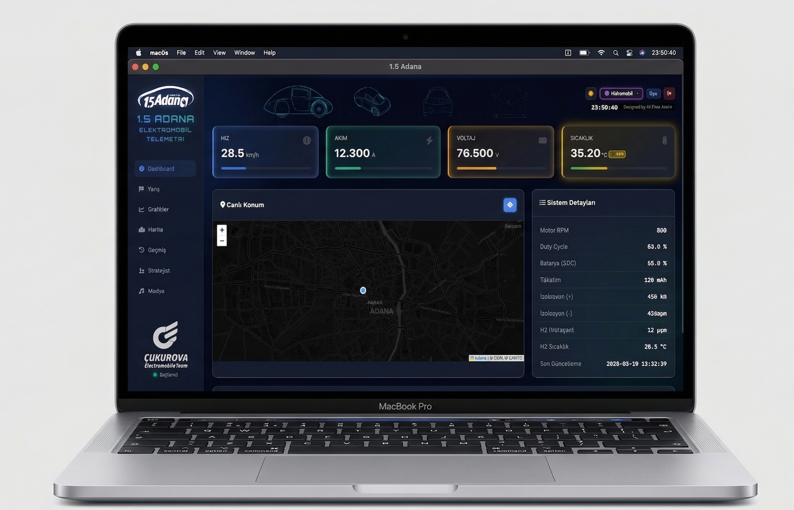
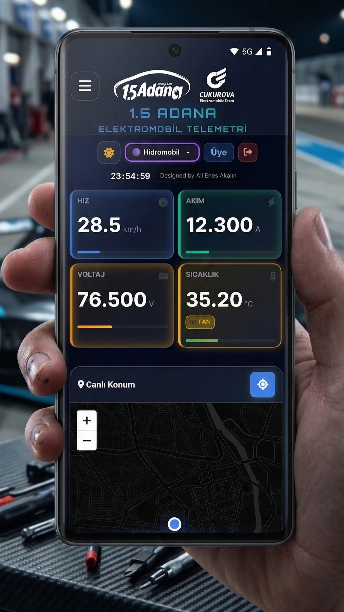

<p align="center">
  
</p>

<h1 align="center">🏎️ 1.5 ADANA — Telemetri Platformu</h1>

<p align="center">
  <strong>Elektrikli araç için gerçek zamanlı telemetri, izleme ve alarm yönetimi</strong><br/>
  STM32 → HTTP → Node.js → Socket.io → Web / Mobil Dashboard
</p>

<p align="center">
  
  
  
  
  
  
  
</p>

> Bu depo, CV/portföy incelemesi için hazırlanmış teknik vitrin dokümanıdır.
> Kurulum, dağıtım ve operasyon adımları bilinçli olarak README'den çıkarılmıştır.

---

## 📸 Arayüz Görselleri

<p align="center">
  
</p>
<p align="center"><em>Masaüstü görünüm: canlı metrik kartları, harita ve sistem detay paneli</em></p>

<p align="center">
  
</p>
<p align="center"><em>Mobil görünüm: tek ekranda kritik telemetri + canlı konum</em></p>

---

## 🎯 Proje Özeti

**1.5 ADANA Telemetri Platformu**, TÜBİTAK Efficiency Challenge aracı için geliştirilmiş uçtan uca veri izleme sistemidir.

Araç üzerindeki STM32F407, CAN bus verilerini toplar ve SIM800L ile düzenli HTTP paketleri gönderir. Sunucu bu verileri kalıcı olarak saklar, aynı anda Socket.io ile bağlı istemcilere yayınlar.

```
┌──────────────┐    JSON HTTP POST    ┌──────────────────┐    Socket.io    ┌───────────────┐
│  STM32 MCU   │ ────────────────────▸│  Node.js Backend │ ───────────────▸│  Web / Mobile │
│  + SIM800L   │      (2s)            │  Express + Mongo │   real-time     │   Dashboard   │
└──────────────┘                      └──────────────────┘                 └───────────────┘
       │                                      │                                     │
  CAN Bus                              Kalıcı depolama                    Chart + Map UI
```

---

## ✨ Öne Çıkan Özellikler

| Alan | Detay |
|:-----|:------|
| Gerçek zamanlı izleme | Socket.io yayın modeli ile anlık dashboard güncellemesi |
| Çoklu veri kaynağı | BMS, motor, GPS, izolasyon ve hidrojen verilerinin tek akışta toplanması |
| Alarmlar | Sıcaklık seviyesine göre fan / buzzer / kontaktör durum yönetimi |
| Veri analizi | Geçmiş telemetri sorgulama, test oturumları, CSV/JSON dışa aktarım |
| Harita entegrasyonu | Leaflet ile canlı konum ve rota takibi |
| Mobil deneyim | PWA + Android hibrit uygulama ile sahada izleme |

---

## 🧩 Mühendislik Yaklaşımı

- Gerçek zamanlı iletim ve kalıcı depolama ayrık olarak ele alındı: yayın (Socket.io) + arşiv (MongoDB).
- Telemetri şeması firmware tarafıyla uyumlu olacak şekilde tasarlandı; alan adları cihazdan birebir aktarılıyor.
- Dashboard tarafında metrik kartları ve alarm renkleri operasyonel karar vermeyi hızlandıracak şekilde optimize edildi.
- Cihaz bazlı filtreleme ile aynı altyapıda birden fazla araç takibi desteklendi.
- Servis kesintilerinde veri tutarlılığı için sunucu tarafında timestamp ve doğrulama kontrolleri uygulandı.

---

## 📡 Telemetri Veri Modeli (Özet)

```json
{
  "device_id": "a1",
  "event_type": "telemetry",
  "uptime_sec": 1234,
  "bms": {
    "voltage_v": 48.6,
    "current_a": 12.3,
    "temp_c": 35.2,
    "soc_pct": 78
  },
  "motor": {
    "rpm": 3200,
    "speed_kph": 42.5,
    "duty_pct": 65
  },
  "gps": {
    "lat_deg": 36.9914,
    "lon_deg": 35.3308
  },
  "hydrogen": {
    "ppm": 12
  }
}
```

---

## 🛡️ Güvenlik ve Dayanıklılık

- JWT tabanlı rol modeli (admin/member/viewer)
- Rate limiting ile API koruması
- Helmet + CORS + NoSQL sanitization katmanları
- Winston ile merkezi loglama ve hata takibi

---

## 👨‍💻 Bu Projede Gösterilen Yetkinlikler

- Gömülü sistemden bulut/backend katmanına veri boru hattı tasarımı
- Gerçek zamanlı web/mobil arayüz mimarisi
- Telemetri odaklı veri modelleme ve performanslı sorgu tasarımı
- Üretim odaklı güvenlik ve izlenebilirlik pratikleri

---

## 🛠️ Teknoloji Seti

- Backend: Node.js, Express, Socket.io, Mongoose
- Frontend: Vanilla JS, Chart.js, Leaflet, PWA
- Mobile: Android WebView + React Native istemci
- Data & Infra: MongoDB, Redis (opsiyonel), JWT, Winston

---

## 🔗 İlişkili Projeler

| Proje | Rol |
|:------|:----|
| Telemetry_SIM800L | STM32 firmware: CAN veri toplama + SIM800L gönderim |
| Esp32_BMS | Batarya yönetim sistemi verileri |
| Esp32_Surucu | Motor sürücü kontrol ve telemetri |
| native-app | React Native istemci |
| android-app | Hibrit Android uygulama |

---

<p align="center">
  
</p>

<p align="center">
  <sub>Made by <strong>1.5 ADANA</strong> — Adana, Türkiye</sub>
</p>
